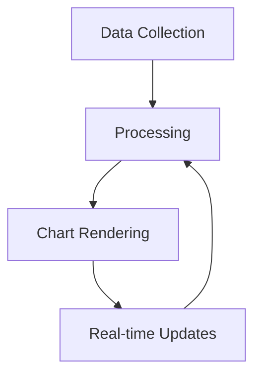

# Local Web Camera 🎥

[](https://github.com/mehmetkahya0/local-web-camera/blob/main/LICENSE)
[](https://github.com/mehmetkahya0/local-web-camera/stargazers)
[](https://github.com/mehmetkahya0/local-web-camera/issues)
[](https://github.com/mehmetkahya0/local-web-camera/network)
[](https://nodejs.org/)
[](https://webrtc.org/)
[](https://visitorbadge.io/status?path=https%3A%2F%2Fgithub.com%2Fmehmetkahya0%2Flocal-web-camera)

A peer-to-peer web camera streaming application built with WebRTC, Socket.IO, and Express. Stream your camera to another device on your local network with minimal latency.

## 🌟 Features

- Real-time video streaming using WebRTC
- Peer-to-peer connection (no server routing for video)
- Automatic network interface detection
- Mobile-friendly interface
- Simple host/viewer architecture
- Connection status monitoring
- Automatic reconnection handling
- Cross-browser compatibility
- iOS and Android support

## 🚀 Quick Start

1. Clone the repository:
```bash
git clone https://github.com/mehmetkahya0/local-web-camera.git
cd local-web-camera
```

2. Install dependencies:
```bash
npm install
```

3. Start the server:
```bash
npm start
```

4. Open the application:
- On the host device: `http://localhost:8080`
- On viewer devices: Use the URL displayed in the console or shared by the host

## 🛠️ Tech Stack

- **Frontend**:
  - Native WebRTC API
  - Vanilla JavaScript
  - HTML5
  - CSS3

- **Backend**:
  - Node.js
  - Express
  - Socket.IO
  - STUN/TURN servers

## 📱 Usage

### As a Host:
1. Click "Start Camera" to enable your device's camera
2. Click "Share Link" to generate a viewing URL
3. Share the generated URL with the viewer

### As a Viewer:
1. Open the URL shared by the host
2. Wait for the connection to be established
3. The stream will start automatically

## 🔧 Configuration

The server runs on port 8080 by default. To change this:

1. Open `server.js`
2. Modify the `port` constant
3. Restart the server

## 🌐 Network Requirements

- Both devices must be on the same network (for best performance)
- Port 8080 must be accessible
- STUN/TURN servers must be reachable
- WebRTC must not be blocked by firewall

## 📋 System Requirements

- Node.js ≥ 14.0.0
- Modern web browser with WebRTC support
- Camera and microphone access
- Network connectivity

## 🔒 Security Features

- HTTPS ready (certificates included)
- Peer-to-peer encryption (WebRTC)
- One viewer per stream limit
- Automatic connection monitoring
- Cross-Origin Resource Sharing (CORS) protection

## Chart Features

The application includes real-time data visualization capabilities using charts:

### Available Charts

- **Connection Status:** Displays real-time connection status of users
- **Bandwidth Usage:** Shows network bandwidth consumption
- **User Activity:** Tracks active users over time

### Using Charts

1. Open the dashboard panel
2. Select desired chart type from the dropdown
3. Charts will update automatically in real-time



### Chart Configuration

Charts can be customized through the settings panel:
- Update frequency (1-60 seconds)
- Data retention period
- Display options

## 🤝 Contributing

1. Fork the repository
2. Create your feature branch (`git checkout -b feature/amazing-feature`)
3. Commit your changes (`git commit -m 'Add some amazing feature'`)
4. Push to the branch (`git push origin feature/amazing-feature`)
5. Open a Pull Request

## 📜 License

This project is licensed under the MIT License - see the [LICENSE](LICENSE) file for details.

## 🔮 Future Improvements

- [ ] Multiple viewer support
- [ ] Chat functionality
- [ ] Screen sharing
- [ ] Recording capability
- [ ] Bandwidth adaptation
- [ ] Room password protection

## 🐛 Known Issues

- iOS Safari may require user interaction to start playing video
- Some networks may block WebRTC connections
- Connection quality depends on network conditions

## 📞 Contact

Mehmet Kahya - [@mehmetkahya0](https://github.com/mehmetkahya0)

Project Link: [https://github.com/mehmetkahya0/local-web-camera](https://github.com/mehmetkahya0/local-web-camera)

## 🙏 Acknowledgments

- WebRTC Community
- Socket.IO Team
- Node.js Community

---

<p align="center">Made with ❤️ by <a href="https://github.com/mehmetkahya0">Mehmet Kahya</a></p>
