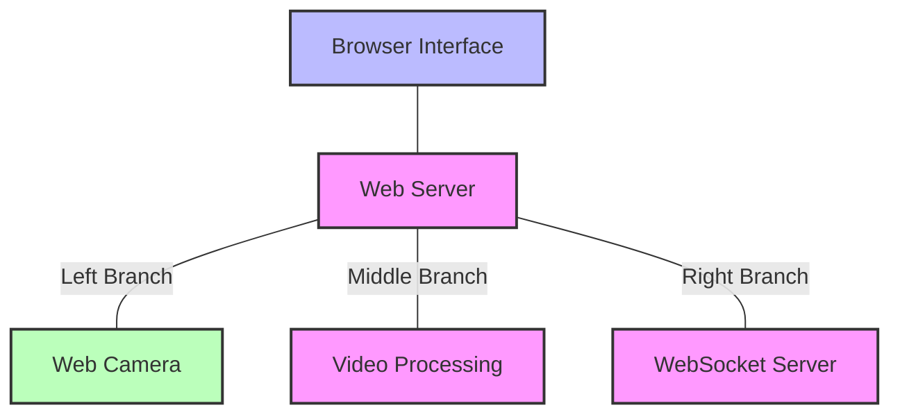

# Local Web Camera Project Architecture

This diagram shows the tree structure of:
- Root: Browser Interface
- Main node: Web Server
- Three branches:
  - Web Camera (Hardware)
  - Video Processing
  - WebSocket Server
